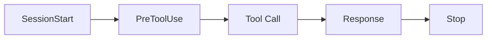

<div align="center">

# Harness Starter

A ready-to-use Claude Code Harness Engineering template  
Works with both new and existing projects

<p>
  
  
  
</p>

> Other platforms (Cursor, Codex, Gemini, etc.): just tell your AI "adapt this template to my environment"

<br>

https://github.com/chenklein26-maker/Harness-Starter

[Xiaohongshu](https://www.xiaohongshu.com/user/profile/5c63da27000000001202556a)

</div>

---

## 📜 Update History

<details open>
<summary><b>2026-06-23</b> — Slimming + Ponytail</summary>

| | |
|---|---|
| 🔧 | `npx` installs 14 L2 core files only, L3+ on demand |
| 🧠 | Simplicity First → YAGNI → stdlib → platform → deps → one line → minimum |
| ⚡ | Format check-then-write, only touches broken files |
| 📦 | Controlled upgrades: `node scripts/upgrade.mjs --dry-run` |
| 🧪 | 54 automated tests covering full toolchain |

</details>

<details open>
<summary><b>2026-06-15</b> — Major Refactor</summary>

| | |
|---|---|
| 🔗 | 5-hook lifecycle: SessionStart → PreToolUse → PostToolUse → PreCompact → Stop |
| 📚 | `harness-context.mjs` shared lib eliminates ~40 lines of duplication |
| ✂️ | CLAUDE.md 146 → 60 lines, references split out |
| 🏷️ | `.claude/.harness-version` version tracking |
| 🎯 | Conditional OpenSpec: only triggers when `openspec/` exists |

</details>

<details open>
<summary><b>2026-06-13</b> — Loop Engineering</summary>

| | |
|---|---|
| 🔁 | GC Autonomous Scan: `node scripts/gc-scan.mjs`, 8 deterministic dimensions |
| 🛑 | Circuit Breaker: 3× no improvement → auto-pause |
| 💾 | State persistence: STATE.md (hot) + LOG.md (cold) |
| 🧩 | 3 Loop templates: daily health, PR babysit, self-evolution |
| ✅ | Maker/Checker separation: coder doesn't grade own work |

</details>

<details open>
<summary><b>2026-06-01</b> — Initial Setup</summary>

| | |
|---|---|
| 🪝 | 4 core hooks: PreToolUse + PostToolUse + SessionStart + Stop |
| 📖 | 6 Karpathy principles in CLAUDE.md |
| 🗺️ | Maturity roadmap: L0→L5 tiered system |
| 📋 | Stop Hook auto-generates review reports by date |

</details>

---

## Design

Every new project requires repeating the same rules to the AI: tech stack, test commands, files to avoid.

Harness Starter automates this through hooks. Install once, use across all projects.

---

## Quick Start

### Option 1: Let AI Set It Up (Recommended)

Tell Claude Code:

```
Initialize this project with Harness Starter
```

The AI will:
1. Clone the template from GitHub
2. Detect your project's tech stack
3. Fill in CLAUDE.md, install Language Server
4. Run health check to confirm everything is ready

### Option 2: npm Install

```bash
npx harness-starter              # Install to current dir
npx harness-starter /path/to/proj  # Install to target dir
npx harness-starter --force      # Override existing files
```

Then tell Claude Code `initialize Harness` to complete setup.

### Option 3: Manual Setup

```bash
# Clone the template
git clone https://github.com/<your-org>/Harness-Starter.git /tmp/harness

# Copy to your project
cp -r /tmp/harness/.claude/  /path/to/your-project/.claude/
cp    /tmp/harness/CLAUDE.md /path/to/your-project/CLAUDE.md
cp    /tmp/harness/.lsp.json /path/to/your-project/.lsp.json

# Install language server
npm install -g typescript-language-server   # TypeScript
pip install pyright                         # Python

# Verify
cd /path/to/your-project && node scripts/check.mjs

# Tell Claude Code: initialize Harness
```

---

## Architecture

During a conversation lifecycle, hooks fire automatically in this order:



| Hook | Timing | Purpose | Level |
|------|--------|---------|:----:|
| SessionStart | New session begins | Inject git status + progress | **L2 Core** |
| PreToolUse | Before tool execution | Safety: .env, dangerous commands | **L2 Core** |
| Stop | After each response | Audit changes, generate report | **L2 Core** |
| PostToolUse 🔧 | After edits | Auto-format code | L3 optional |
| PreCompact 🔧 | Before context compaction | Preserve session state | L3 optional |

> 🔧 L3+ features are not installed by default. Copy the hook file and register in `settings.json` to enable.

---

## Project Structure

**`npx harness-starter` default install (L2 Core):**

```
your-project/
├── CLAUDE.md                   AI behavior rules (~70 lines, with 6-rung ladder)
├── .lsp.json                   LSP configuration
├── .gitignore
│
├── scripts/
│   ├── check.mjs               Health check
│   └── init.mjs                One-click install
│
└── .claude/
    ├── settings.json           Hook registration (PostToolUse/PreCompact commented out)
    ├── .harness-state          State awareness
    ├── .harness-version        Version tag
    ├── hooks/
    │   ├── pre-tool-check.mjs  Safety interceptor
    │   ├── session-context.mjs Context injection
    │   ├── session-review.mjs  Change review
    │   └── lib/
    │       └── harness-context.mjs  Shared data layer
    └── skills/
        ├── harness-init/       AI setup workflow
        └── harness-mode/       Workflow modes
```

**L3+ optional (available in GitHub repo, copy on demand):**

```
├── scripts/
│   ├── gc-scan.mjs             GC scanner (L4)
│   └── upgrade.mjs             Smart upgrade (L3)
│
├── .claude/hooks/
│   ├── post-tool-check.mjs     Auto-formatter (L3)
│   └── pre-compact.mjs         Long-session guard (L3)
│
├── .claude/skills/
│   ├── harness-gc/             GC Agent (L4)
│   ├── tech-review/            Technical decision review (L2+)
│   └── verify-goal/            Goal verification (L2+)
│
├── .claude/references/        Documentation
├── tests/                      Automated tests (maintainers only)
└── vitest.config.js
```

---

## Usage

### AI Setup (Recommended)

Tell Claude Code:

```
Initialize this project with Harness Starter
```

The AI will:

1. **Fetch** the template from GitHub
2. **Copy** `.claude/`, `CLAUDE.md`, `.lsp.json` into your project
3. **Detect** your tech stack from `package.json` / `pyproject.toml` / `go.mod`
4. **Configure** CLAUDE.md placeholders, install Language Server
5. **Verify** with `node scripts/check.mjs`

> If the files are already in your project, just say "initialize Harness."

The full initialization flow is defined in `.claude/skills/harness-init/SKILL.md`.

### Manual Setup

```bash
# 1. Clone template
git clone https://github.com/<your-org>/Harness-Starter.git /tmp/harness

# 2. Copy to project
cp -r /tmp/harness/.claude/  /path/to/your-project/.claude/
cp    /tmp/harness/CLAUDE.md /path/to/your-project/CLAUDE.md
cp    /tmp/harness/.lsp.json /path/to/your-project/.lsp.json

# 3. Install language server
npm install -g typescript-language-server   # TypeScript
pip install pyright                         # Python

# 4. Verify
cd /path/to/your-project && node scripts/check.mjs

# 5. Tell Claude Code: initialize Harness
```

## Maturity Roadmap

| Level | Name | Description |
|:---:|---|------|
| Level | Name | Description |
|:---:|---|------|
| L0 | Bare | No template, manual prompting |
| L1 | Rules | CLAUDE.md + behavior guidelines |
| **L2** | **Feedback** | **PreToolUse + SessionStart + Stop + ≥3 reviews ← Out of the box** |
| L3 | Auto-Correction 🔧 | PostToolUse + PreCompact auto-format (manual enable) |
| L4 | Autonomous 🔧 | gc-scan 0 critical × 3 + Loop updates |
| L5 | Loop Engineering 🔄 | External scheduling + Maker/Checker separation (built-in) |

> Details → GitHub repo `.claude/references/maturity-roadmap.md`

---

## Extensions

### Workflow Modes

Three modes that auto-tune review strictness:

| Command | Effect |
|---------|--------|
| `/harness-mode full` | Full checks, all rules active |
| `/harness-mode hotfix` | Emergency fix, skip line/file count |
| `/harness-mode tweak` | Minimal, .env protection only |
| `/harness-phase design` | Relaxed, skip debug residue |
| `/harness-phase fix` | Tightened, warn if >5 files changed |

Stored in `.claude/.harness-state`, injected at SessionStart.

### GC Autonomous Scanning

```bash
# Manual scan
node scripts/gc-scan.mjs

# Scheduled loop (24h interval)
/loop 24h "node scripts/gc-scan.mjs"

# Preview upgrades
node scripts/upgrade.mjs --dry-run
```

8 deterministic dimensions: CLAUDE.md completeness, Git status, TODO/FIXME density, .gitignore health, Hook registration, Harness state, TypeScript errors, LSP config. See GitHub repo `.claude/skills/harness-gc/SKILL.md`.

### Template Upgrade

```bash
# Check and upgrade
node scripts/upgrade.mjs

# Preview only
node scripts/upgrade.mjs --dry-run
```

Version tracking (`.claude/.harness-version`), smart classification of "user-modified" vs "template-original" files.

### Environment Variables

| Variable | Effect |
|----------|--------|
| `HARNESS_POSTTOOL_FORMAT=0` | Disable auto-formatting |
| `HARNESS_POSTTOOL_FORMAT_SKIP_PATTERNS=*.md,*.json` | Skip file types |
| `HARNESS_OPENSPEC_CHECK=1` | Enable OpenSpec awareness |

### Multi-Agent Teams

Split complex tasks across multiple agents for parallel work:
- Explore multiple approaches simultaneously
- Separate frontend/backend/testing into parallel streams
- Isolate long-running tasks from the main conversation

---

## Migration

```bash
cp -r .claude/ CLAUDE.md .lsp.json /path/to/new-project/
```

Edit the first three lines of CLAUDE.md, reinstall the language server, and you're ready to go.

---

<div align="center">

[中文版](README.md) · MIT License

</div>
